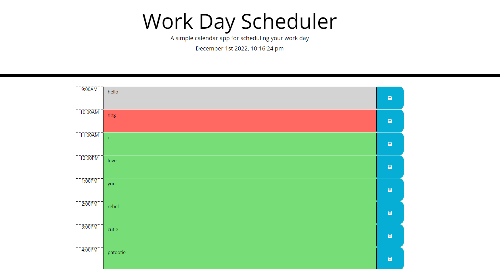

  # MSUBC_Module5_CH Calendar by Mateusz Zielinski
  ## Description
  This is a calender program set for the current day, displaying hours from 9-4, in which the user can set and save hourly tasks to local storage. This program also shows the current date and time, as well as color coded hours
  
  
  ## License
  
  This application is not currently under any license agreement.
  ## Table of Contents
  - [License](#License)
  - [Usage](#Usage)
  - [Installation](#Installation)
  - [Testing](#Testing)
  - [Contributing](#Contributing)
  ## Usage
  - open index.html in a web browser
  - type in your task for the preferred hour, then click the save button correlating to that hour
  - when you load the page again, your previously saved tasks will be displayed
  ## Installation
  - open gitbash
  - navigate to the desired parent folder 
  - type into gitbash 'git clone https://github.com/IMadeThisJustToPostThis/MSUBC_Module5_CH-Calendar.git'
  ## Testing
  no tests, simply bug tested manually
  ## Contributing
  contibute however you want i don't care
  ## Questions
  Github:<https://github.com/IMadeThisJustToPostThis>
  
  Email: zielinm2@mail.lcc.edu